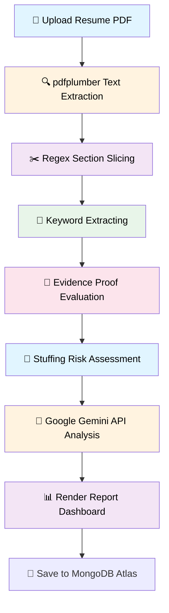

<div align="center">

```
 ____                 _____ _            _  _____ ____  
|  _ \ __ _ ___ ___  |_   _| |__   ___  / \|_   _/ ___| 
| |_) / _` / __/ __|   | | | '_ \ / _ \/ _ \ | | \___ \ 
|  __/ (_| \__ \__ \   | | | | | |  __/ ___ \| |  ___) |
|_|   \__,_|___/___/   |_| |_| |_|\___/_/   \_\_| |____/ 
```

### *Where AI meets your career aspirations*

[](https://www.python.org/)
[](https://ai.google.dev/)
[](https://www.docker.com/)
[](https://www.mongodb.com/)
[](https://www.jenkins.io/)

[Quick Start](#-quick-start) · [Features](#-features) · [CI/CD Pipeline](#-jenkins-cicd-pipeline) · [Docker Configuration](#-docker-setup)

<br>


<br>


</div>

## 💭 The Story

You've spent hours perfecting your resume. You hit submit. **Silence.**

Was it the keywords? The format? The ATS? You'll never know—until now.

**PassTheATS** doesn't just scan your resume. It thinks like a recruiter, validates like an ATS, and coaches like a mentor. All powered by Gemini AI and a robust document parsing architecture.

<br>

## 🌟 Features

### ✅ Core Resume Analysis
<table>
<tr>
<td width="33%">

**📄 Smart Upload**
- PDF resume parsing via `pdfplumber`
- Job description input
- Role-based templates
- Real-time processing

</td>
td width="33%">

**🎯 ATS Scoring**
- Keyword match analysis
- Missing keyword detection
- Compatibility percentage
- Industry benchmarks

</td>
<td width="33%">

**📊 Visual Reports**
- Interactive dashboard
- Progress tracking
- Historical analysis
- Risk assessment visualizations

</td>
</tr>
</table>

### 🧠 Skill Proof Verification *(Unique Feature)*

Unlike traditional ATS tools, we verify if skills are actually **proven**:

```
❌ Listed Only   → Skill mentioned but no evidence
✅ Proven        → Backed by projects/experience

Skill Strength:
├─ 🟢 Strong   (Multiple proofs in Projects/Experience)
├─ 🟡 Medium   (Some proof in overall body)
├─ 🟠 Weak     (Listed in Skills section but no proof)
└─ 🔴 Missing  (No mention in the resume)
```

**Output:** Proof Score (%), Skill classification, Recommendations

### 🚨 Anti-Cheat Detection

Identifies resume manipulation:

- **Keyword Stuffing** - Excessive repetition without context
- **Fake Skills** - Listed in the skills block but never used in projects/experience
- **Weak Evidence** - Technical claims without substantiation

**Risk Levels:** `LOW` | `MEDIUM` | `HIGH`  
**Output:** Detailed reasonings, metrics, and actionable fixes

### 🎯 Role-Based Rubric Scoring

Weighted evaluation like real companies based on custom schemas:

```javascript
const rubric = {
  "Backend Engineer": {
    "python": 20,
    "sql": 20,
    "api": 20,
    "authentication": 15,
    "docker": 10
  }
}
```

**Roles Supported:** Backend Developer, Frontend Developer, Cloud Engineer, and DevOps Intern.

### 🤖 AI-Powered Intelligence

Google Gemini API integration for advanced insights:

| Feature | Description |
|---------|-------------|
| 💡 **Resume Suggestions** | Personalized improvement recommendations starting with action verbs |
| 🎤 **Interview Questions** | Role-specific questions targeting your weakest/unproven skills |
| 🧠 **Recruiter Verdict** | 4-line professional assessment of overall readiness |

**Reliability:** Seamless fallback logic to offline analysis if the Gemini API fails.

### 🔐 User System

Full authentication & history management powered by MongoDB Atlas:

- ✅ Secure registration & login
- ✅ Password hashing via `Werkzeug`
- ✅ Dynamic analysis history storage
- ✅ Full report replay & history dashboard
- ✅ Delete saved reports capability

<br>

## 🛠️ Tech Stack

### Backend & Storage


### AI & Tools


### Frontend


**Architecture:**
```
Flask (Backend) → Gemini AI (Analysis) → MongoDB Atlas (Data Layer)
         ↓
    Docker Container → Jenkins CI/CD → Docker Hub Registry
```

<br>

## 🚀 Quick Start

### Local Development

#### 1. Clone repository
```bash
git clone https://github.com/TusarGoswami/PassTheATS.git
cd PassTheATS
```

#### 2. Install dependencies
```bash
pip install -r requirements.txt
```

#### 3. Configure environment
Create a `.env` file in the project root:
```env
GEMINI_API_KEY=your_api_key_here
MONGO_URI=mongodb://localhost:27017/passtheats
```

#### 4. Run application
```bash
python app.py
```

#### 5. Open browser
Go to [http://localhost:5000](http://localhost:5000)

<br>

## 🐳 Docker Setup

Build and run your containerized environment:

```bash
# Build the image locally
docker build -t passtheats-web:latest .

# Run with environment variables
docker run -p 5000:5000 --env-file .env passtheats-web:latest
```

<br>

## 📂 Project Map

```
PassTheATS/
├── 🧠 core/           # Intelligence & analysis layer
├── 🎨 templates/      # Jinja2 HTML templates
├── 💾 db/             # Database connection & models
├── 📁 static/         # Frontend CSS, JS & assets
├── 🚀 app.py          # Flask mission control
└── ⚙️ Jenkinsfile      # Declarative CI/CD pipeline
```

<details>
<summary>📋 View detailed structure</summary>

```
PassTheATS/
│
├── 📄 .dockerignore               # Docker build exclusions
├── 📄 .env                        # Local environment secrets
├── 📄 .gitignore                  # Git ignore rules
├── 🚀 app.py                      # Flask application entry point
├── 🐳 Dockerfile                  # Production container configuration
├── 🐳 Dockerfile.jenkins          # Jenkins environment runner
├── ⚙️ Jenkinsfile                  # Declarative Jenkins pipeline script
├── 🔧 list_models.py              # Gemini model testing utility
├── 📖 README.md                   # This documentation
├── 📋 requirements.txt            # Python dependencies
│
├── 🧠 core/                       # Intelligence layer
│   ├── ai_interview_questions.py  # Gemini question generator
│   ├── ai_suggestions.py          # Gemini resume feedback engine
│   ├── ai_summary.py              # Recruiter verdict summary generator
│   ├── cheat_detector.py          # Keyword stuffing checker
│   ├── interview_questions.py     # Base fallback questions
│   ├── jd_parser.py               # Fallback suggestions engine
│   ├── jd_templates.py            # Custom roles templates (Backend, Frontend, etc)
│   ├── keyword_extractor.py       # Technical keyword cleaning & parsing
│   ├── proof_checker.py           # Skill evidence checker (Strong/Medium/Weak)
│   ├── resume_parser.py           # pdfplumber PDF reader integration
│   ├── resume_sections.py         # Sequential regex layout segmenter
│   ├── rubrics.py                 # Weighted role metrics (Backend, DevOps, etc)
│   ├── scoring_engine.py          # ATS & Rubric calculations
│   └── __init__.py                # Package initializer
│
├── 💾 db/                         # Database layer
│   └── models.py                  # PyMongo models (User, Report)
│
├── 🎨 static/                     # Frontend assets
│   ├── style.css                  # Glassmorphism visual design
│   ├── assets/                    # Static graphics
│   └── js/
│       └── theme.js               # Advanced dark/light theme engine
│
└── 🎨 templates/                  # HTML views
    ├── demo.html                  # Demo analyzer (No login required)
    ├── history.html               # User reports historical tracking
    ├── index.html                 # Main landing dashboard
    ├── login.html                 # Authentication login
    ├── register.html              # Authentication signup
    └── report.html                # High-fidelity dashboard report
```

</details>

<br>

## ⚙️ Configuration

### Role-Based Rubrics (`core/rubrics.py`):
```python
ROLE_RUBRICS = {
    "backend_developer": {
        "python": 20,
        "java": 15,
        "sql": 20,
        "api": 20,
        "authentication": 15,
        "docker": 10
    }
}
```

### Database Switcher (`db/models.py`):
```python
def init_db(app):
    global db
    mongo_uri = os.environ.get("MONGO_URI", "mongodb://localhost:27017/passtheats")
    client = MongoClient(mongo_uri)
    db = client["passtheats"]
```

<br>

## 🎯 How It Works



<br>

## 🔄 Jenkins CI/CD Pipeline

Automated distribution pipeline defined in the local [Jenkinsfile](file:///c:/Users/tusar/OneDrive/Desktop/PassTheATS-main/Jenkinsfile):

```
[Checkout SCM] ──> [Docker Build] ──> [Security/Sanity Test] ──> [Push to Docker Hub]
```

**Pipeline Stages:**
1. **Checkout:** Clones the latest branch state from source control.
2. **Docker Build:** Packages the codebase into a containerized `passtheats-web` image.
3. **Security / Sanity Test:** Starts the container and tests if the Flask runtime environment executes correctly.
4. **Push to Docker Hub:** Signs into Docker registry securely using Jenkins credentials, tagging and pushing both `build-${BUILD_NUMBER}` and `latest` tags.

<br>

## 💡 What Makes Us Different

| Feature | Traditional ATS | PassTheATS |
|---------|:---------------:|:----------:|
| Keyword Matching | ✅ Basic | ✅ Context-Aware |
| Skill Proof Verification | ❌ None | ✅ **Unique (Strong/Weak Evaluation)** |
| Keyword Stuffing Detection | ❌ None | ✅ **Unique (Anti-Cheat Engine)** |
| AI Resume Suggestions | ❌ None | ✅ Gemini-powered Action Prompts |
| AI Interview Questions | ❌ None | ✅ Target-oriented to Weak Skills |
| Database Storage | ❌ Single Scan | ✅ persistent **MongoDB Atlas** |
| CI/CD Pipeline | ❌ Manual | ✅ Automated **Jenkins Pipeline** |

<br>

## 🧠 One-Line Summary

> An AI-driven resume scoring and anti-cheat platform built with Flask, Google Gemini API, and MongoDB, fully containerized with Docker and distributed via an automated Jenkins CI/CD pipeline.

**Tech Stack:** Python · Flask · Gemini AI · MongoDB · Docker · Jenkins

<br>

<div align="center">

## 👨‍💻 Creator

**Tusar Goswami**  
*Full Stack & AI Developer*

[](https://github.com/TusarGoswami)
[](https://linkedin.com/in/tusargoswami)

*Building tools that make a difference* 🚀

<br>

---

<sub>**PassTheATS** · Empowering job seekers with AI-driven insights</sub>

⭐ Star this repo if it helped you land an interview!


**Made with ❤️ and lots of ☕**

</div>
